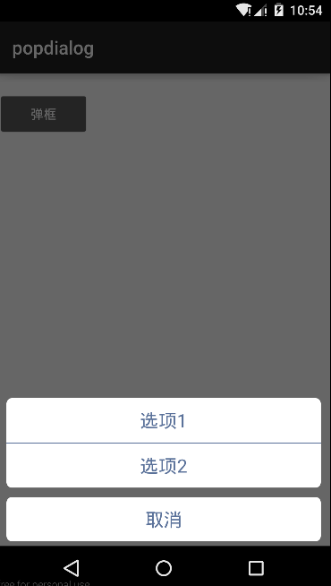

# 仿IOS底部选项弹框组件

### 依赖配置(仓库地址见maven_repo)
  >```compile 'com.yanling.android.popdialog:bottommenu:1.0'```

### 使用说明

  ```java
    //创建对象
    BottomMenuDialog dialog = new BottomMenuDialog();
    //添加选项列表
    String[] array = {"选项１", "选项２"};
    dialog.setMenuItems(context, array);
    //添加选项点击监听事件
    dialog.setOnItemClickListener(listener);
    //展示界面
    dialog.show();
    //关闭界面
    dialog.dismiss();

    //自定义选项框
    /**
     *通过setMenuItems(context, items, listDrawable)扩展弹框选项
     *其中items表示BottomMenuItem对象列表，listDrawable标示取消按钮选项的drawable背景
     *
     */
  ```
### 界面展示

    
